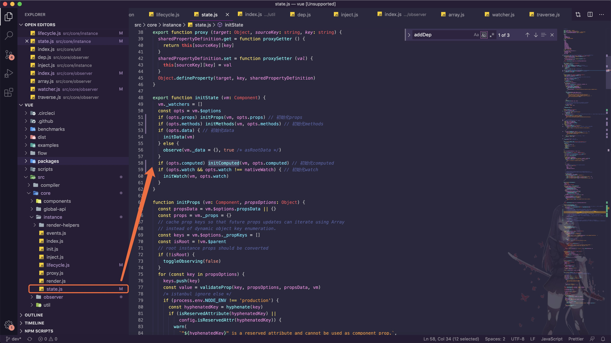

## Vue源码解读-computed的实现原理

### 一、computed是什么？

先让我们快速的回忆一下computed是做什么的。

计算属性允许我们对指定的视图，复杂的值计算。这些值将绑定到依赖项值，只在需要时更新。

例如下面这个案例：

```vue
<div id="app">
  <span @click="change">{{sum}}</span>
</div>
<script src="./vue2.6.js"></script>
<script>
  new Vue({
    el: "#app",
    data() {
      return {
        count: 1,
      }
    },
    methods: {
      change() {
        this.count = 2
      },
    },
    computed: {
      sum() {
        return this.count + 1
      },
    },
  })
</script>
```


### 二、什么时候进行的初始化？

computed的初始化是在initState()方法中调用initComputed()来进行的。

发生在initProps() 、initMethods() 和 initData() 之后。

对应的源码位置为：



### 三、初始化时做了哪些事？

初始化computed主要是调用initComputed()方法，对于这个方法我们可以来写一些伪代码：

```javascript
function initComputed (vm, computed) {
  const watchers = vm._computedWatchers = Object.create(null)
  for (const key in computed) {
    const userDef = computed[key]
    watchers[key] = new Watcher(
      vm,
      getter || noop, // 一个求值函数, 结果为sum的值
      noop, // 回调函数, noop 表示无操作
      { lazy: true } // 标记此 Watcher 为 ComputedWatcher
    )
    defineComputed(vm, key, userDef)
  }
}
```

在初始化`computed`时实际上是为每一个计算属性返回一个`new Watcher()`，也就是`Watcher`实例对象。

不过这个对象比较特殊，它的`lazy`属性是为`true`的，以此来区分它是一个`ComputedWatcher`。

且在初始化此`ComputedWatcher`的时候也会有一个`dirty`属性默认为`true`，它是用来控制`computed`是否要重新计算。

在初始化完`ComputedWatcher`之后，还会调用执行一下它的`evaluate()`方法来进行计算。在此计算方法中由于会执行`watcher`的`get`方法，所以会将`Dep.target`指向当前的这个`ComputedWatcher`对象，并且因为计算的时候会获取它所依赖的所有`data`或者`props`属性，所以又会触发这些属性进行依赖收集，将当前的这个`ComputedWatcher`对象添加到各个属性的`subs`列表中，等待更新。当然，在调用完毕之后，就会将`Dep.target`指回上一个`watcher`，因为实际上`Vue`在这个过程中是会维护一个`targetStack`的。

同时，每个`ComputedWatcher`对象中又会维护一个`deps`列表用来存放它所依赖的所有`data`或者`props`属性，这样就将每个`ComputedWatcher`与它的所有依赖属性建立起了联系。

在执行完这系列操作之后，就算是初始化`computed`成功了。

那么当下次`ComputedWatcher`依赖的属性发生变化的时候，会进行消息发放，也就是通知其`subs`中所有`watcher`进行更新。当执行到`ComputedWatcher`更新的时候它比较特殊，因为在`watcher`的`update`方法中是会有判断实例的`lazy`属性是否为`true`的这一步，如果是的话就只将实例的`dirty`属性设置为`true`，而不会像其它的`watcher`一样进行批量异步更新。

所以才说`ComputedWatcher`是有这种惰性的，它在它所依赖的属性发生变化的时候不会立马重新计算，而仅仅是将`dirty`属性设置为了`true`而已。

只有当它被调用的时候，因为此时`dirty`属性为`true`了，才会触发`evaluate()`方法进行重新计算。

